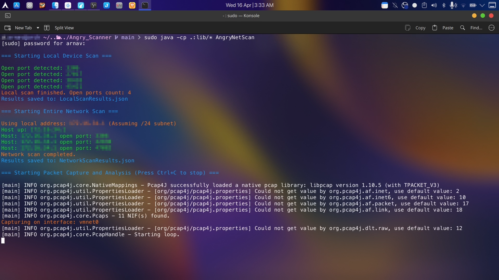
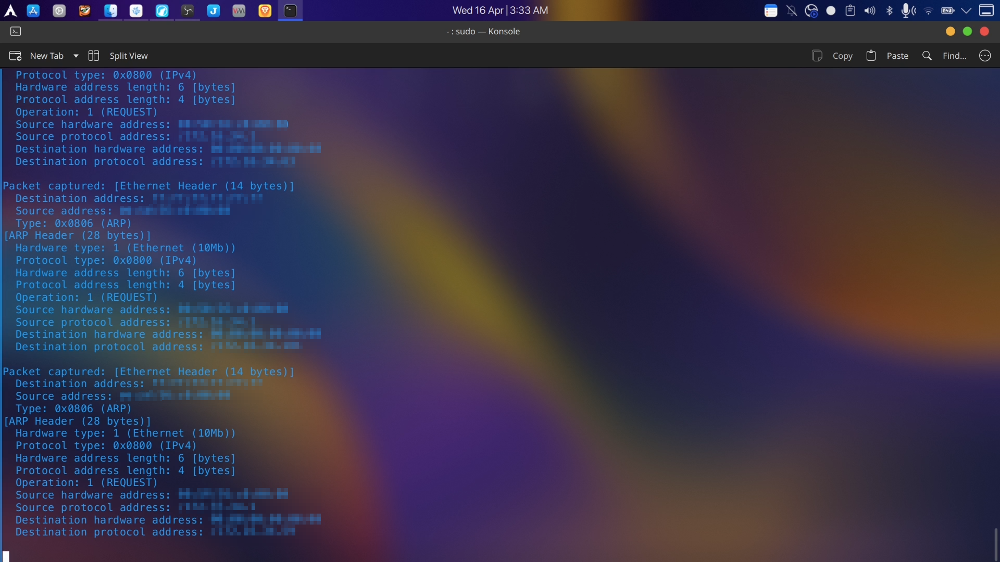

# Angry Network Scanner

**Local Network Scan**



**Real-time Network Packet Capture**



## Compile (Linux)
Make changes to AngryNetScan.java and run
```bash
javac -cp .:lib/* AngryNetScan.java
```

## Run (Linux)
```bash
sudo java -cp .:lib/* AngryNetScan
```

## Note
For Windows or Mac, replace libraries in `lib` folder with your OS specific versions and run compile command again and run the program.
